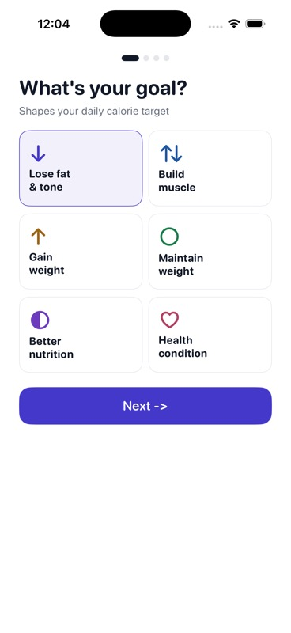
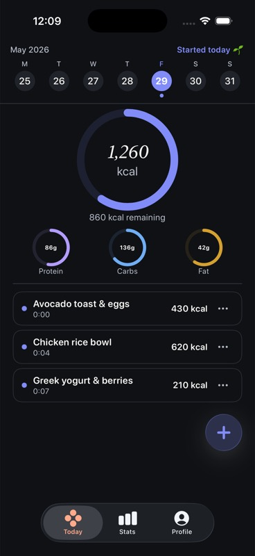
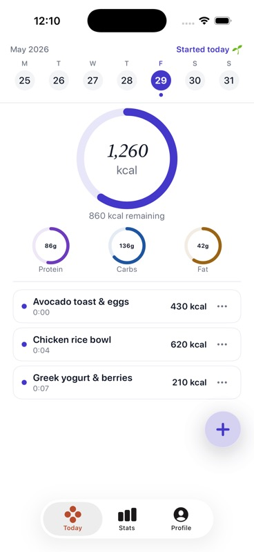
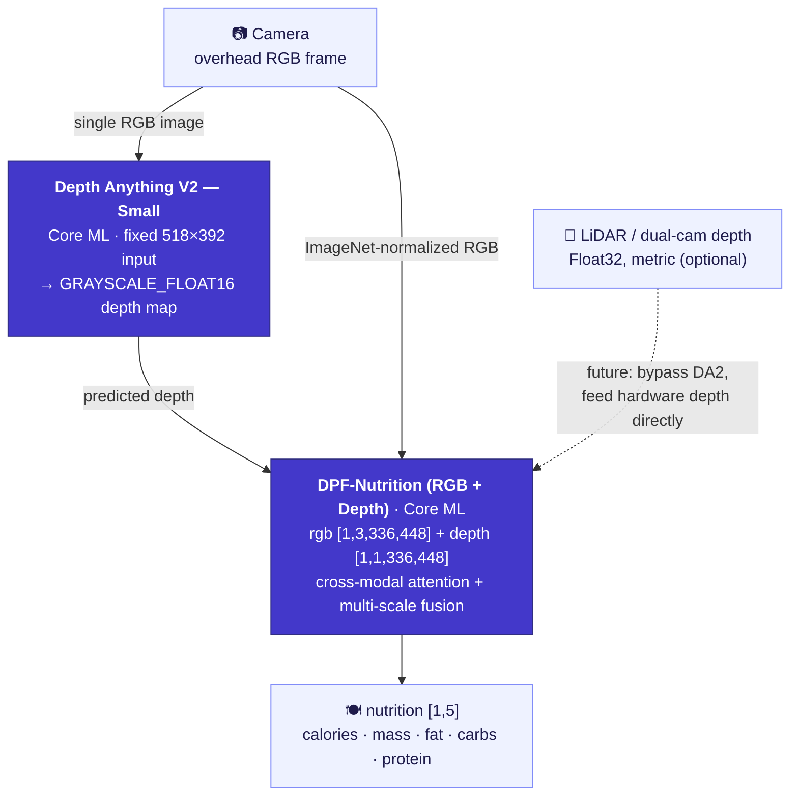

<div align="center">

# CalBro — On-Device Food Calorie & Nutrition Tracking for iOS

**A native SwiftUI iPhone app that estimates calories and macronutrients from a single overhead food photo, fully on-device, using a Depth-Anything-V2 → DPF-Nutrition Core ML pipeline.**

[](https://www.apple.com/ios/)
[](https://developer.apple.com/xcode/swiftui/)
[-5B5BD6)](https://developer.apple.com/documentation/coreml)
[](https://github.com/T0MYYY/Nutrition5k)
[](https://huggingface.co/T0MYYY/dpf-nutrition)

</div>

> ⚠️ **Research prototype — not a calibrated product.** The vision backbone has **not** been rigorously calibrated for iPhone cameras/sensors. The nutrition numbers it produces **have no reference value** and must not be used for medical, dietary, or clinical decisions. See [Limitations](#limitations).

This is the **applied / deployment companion** to our research repository [**Nutrition5k — Vision-Based Food Calorie & Nutrition Estimation**](https://github.com/T0MYYY/Nutrition5k).

> **Which model does CalBro use?** CalBro ships the **[DPF-Nutrition](https://arxiv.org/abs/2310.11702)** model — *Depth Prediction and Fusion* (Han et al., *Foods* 2023) — **not** the CVPR 2021 *Nutrition5k* architecture. DPF-Nutrition is a monocular RGB → predicted-depth → RGB-D-fusion regressor, which is exactly what suits a single-photo phone capture. Our research repo reproduces *both* the CVPR 2021 experiments and DPF-Nutrition; **CalBro deploys the DPF-Nutrition track.** We convert that trained model to Core ML and ship it inside a polished iOS app that runs entirely offline.

---

## Screenshots

| Onboarding | Today (dark) | Today (light) |
|:---:|:---:|:---:|
|  |  |  |
| Goal-driven calorie target setup | Daily ring, macro rings, meal log, weekly strip | Full light/dark theming |

---

## What it does

- **Scan a meal.** Point the phone straight down at the plate. An on-device guidance system (CoreMotion tilt + LiDAR/depth distance) tells you when the angle and height are right, then auto-captures.
- **Estimate nutrition on-device.** The captured RGB frame plus a depth map are fed through a two-stage Core ML pipeline to predict **calories, mass, fat, carbs, protein** — no network, no account, no data leaves the phone.
- **Track the day.** A calorie ring, macro rings, an editable meal log, a real month calendar, weekly stats, and a goal/weight-prediction simulator.
- **Integrate with the system.** Apple Health (read body metrics, sync exercise burn), local-notification reminders, and Home/Lock-screen widgets via WidgetKit + App Group.

---

## The on-device ML pipeline



- **Stage 1 — Depth.** [Depth Anything V2 Small](https://github.com/DepthAnything/Depth-Anything-V2) converted to Core ML estimates a dense depth map from the single RGB frame (fixed **518×392** input). On LiDAR-equipped iPhones the hardware depth frame is also captured and exposed for a future bypass of this stage.
- **Stage 2 — Nutrition.** Our **DPF-Nutrition** RGB-D regressor (trained in the [research repo](https://github.com/T0MYYY/Nutrition5k)) consumes ImageNet-normalized RGB + the depth map and regresses the five nutrition scalars.
- Both models are bundled in the app and loaded with `MLModel(contentsOf:)`; the first launch compiles them (30–60 s) and caches the `.mlmodelc`.

Implementation: `CalBro/Services/NutritionPredictionService.swift`, `ImagePreprocessing.swift`, `CameraCaptureController.swift`.

---

## Architecture

- **SwiftUI + `@Observable` MVVM**, iOS 26, three-tab shell (Today / Stats / Profile). Camera is a full-screen modal launched from the Today **+** button.
- **Capture guidance** (`CameraCaptureController`, `CameraFlowViewModel`): selects `.builtInLiDARDepthCamera` for true depth, gates capture on overhead tilt (< 28°) **and** a tight **27–34 cm** height band, shown as a unit-less distance bar.
- **Persistence**: meals, profile, and integration settings in `UserDefaults`; today's nutrition snapshot mirrored into an **App Group** (`group.com.wydfcc.calbro`) for the widget.
- **WidgetKit** (`CalBroWidget/`): home-screen (small/medium) and lock-screen (circular/rectangular) widgets reading the shared snapshot; refreshed on every meal change.
- **HealthKit** (`RealHealthKitSyncService`): authorization + reads body mass / height / DOB / sex / active energy and back-fills the profile (the unified Health source replaces manually-entered values).
- **Local notifications** (`RealReminderService`): daily meal-logging reminder + event-driven calorie-warning at 90 % of target.
- **Units**: height & weight switch between metric and imperial; calories are always kcal.

```
CalBro/
├── Models/            UserProfile, LoggedMeal, nutrition & camera models
├── ViewModels/        Dashboard, CameraFlow, Calendar, Goals, Integration, …
├── Services/          CoreML pipeline, camera, HealthKit, reminders, meal store
├── Shared/            SharedNutrition.swift (App Group bridge, app + widget)
├── Views/             Today, Camera, Calendar, Stats, Goals, Integrations, …
├── DesignSystem/      CBColors / CBTypography / CBGlass / CBComponents
└── Resources/Models/  bundled Core ML packages (DA2 + DPF)
CalBroWidget/          WidgetKit extension
```

---

## Build & run

1. Place the Core ML models (not in git — too large) into `CalBro/Resources/Models/` — see [`MODELS.md`](CalBro/Resources/Models/MODELS.md).
2. Open `CalBro.xcodeproj` in **Xcode 26+**.
3. Select the **CalBro** scheme.
4. Run on an iOS 26 device (LiDAR iPhone Pro recommended for depth) or simulator.

```bash
# Simulator build
xcodebuild -project CalBro.xcodeproj -scheme CalBro \
  -destination 'platform=iOS Simulator,name=iPhone 17 Pro' -configuration Debug build

# Device build (automatic signing registers App Group + HealthKit + widget)
xcodebuild -project CalBro.xcodeproj -scheme CalBro \
  -destination 'generic/platform=iOS' -configuration Debug -allowProvisioningUpdates build
```

Capabilities used: **App Groups**, **HealthKit**, **Camera**, **User Notifications**, **WidgetKit**.

---

## Limitations

**This app is a four-person student project, and its nutrition outputs are not trustworthy.** The honest constraints:

- **The backbone is not rigorously calibrated.** The vision model has not been calibrated against iPhone camera intrinsics or real plated-food ground truth on-device. **The numbers it produces have no reference value** — treat them as a UI/architecture demo, not measurements.
- **Data scarcity makes calibration infeasible for us.** Calibrating a depth/nutrition model for phone capture needs a large, device-specific, ground-truth-weighed dataset. Even if all four of us logged **4 meals/day for a full year**, that is only **~5,840 photos** — nowhere near enough to calibrate a sensor + model pipeline, and that ignores that **each iPhone model (lens, LiDAR, ISP) would likely need its own adaptation.**
- **Monocular depth is a proxy.** Depth Anything V2 estimates relative depth from one RGB frame; it is not metric and is not tuned for food/portion geometry.
- **No food database / portion priors.** There is no backend, food-recognition database, or per-ingredient breakdown — only the end-to-end regressor's five scalars.

> **Do not use CalBro for medical, dietary, or clinical decisions.** It is a research/engineering prototype.

---

## Future work

- **Use the iPhone LiDAR depth directly.** The hardware depth frame (`kCVPixelFormatType_DepthFloat32`, metric, in meters) has strong potential to **replace the monocular Depth-Anything stage entirely** — the app already captures and exposes it (`CameraCaptureController.currentDepthBuffer`). What's missing is the **data collection** to retrain/calibrate DPF on real LiDAR depth, which our resources don't allow.
- **CLIP / VLM fusion.** Fusing a CLIP-style image-text model (food category priors, open-vocabulary recognition) with the RGB-D regressor is a promising direction for both accuracy and per-ingredient breakdowns.
- **Per-device calibration & a real ground-truth dataset** (weighed meals across iPhone models).
- Weight-history tracking, richer Health write-back, and Live Activities.

---

## Relationship to the research repo

CalBro is the deployment track of **[T0MYYY/Nutrition5k](https://github.com/T0MYYY/Nutrition5k)** — where the models are trained and the CVPR 2021 paper is reproduced. See that repo for methodology, metrics, and the live web demo.

## Citations

CalBro deploys the **DPF-Nutrition** model. If you use this work, please cite the original paper:

```bibtex
@article{han2023dpfnutrition,
  title   = {DPF-Nutrition: Food Nutrition Estimation via Depth Prediction and Fusion},
  author  = {Han, Yuzhe and Cheng, Qimin and Wu, Wenjin and Huang, Ziyang},
  journal = {Foods},
  volume  = {12},
  number  = {23},
  pages   = {4293},
  year    = {2023},
  doi     = {10.3390/foods12234293}
}
```

The dataset and the original benchmark:

```bibtex
@inproceedings{thames2021nutrition5k,
  title     = {Nutrition5k: Towards Automatic Nutritional Understanding of Generic Food},
  author    = {Thames, Quin and Karpur, Arjun and Norris, Wade and Xia, Fangting and Panait, Liviu and Weyand, Tobias and Sim, Jack},
  booktitle = {CVPR},
  year      = {2021}
}
```

Depth backbone: [Depth Anything V2](https://github.com/DepthAnything/Depth-Anything-V2) (Yang et al., 2024).

## License / disclaimer

Research/educational prototype. Nutrition outputs are **not** validated and must not inform health decisions.
